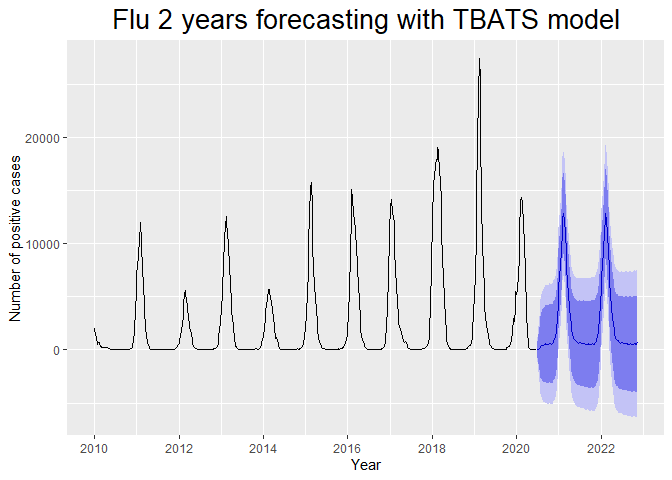

Flu time series forecasting
================
Nguyen Cong Tung
2021 05

### Importing the libraries:

``` r
install.packages("forecast")
install.packages("stats")
install.packages("ggplot2")
install.packages("dplyr")
install.packages("tidyr")
install.packages("zoo")
install.packages("lubridate")
install.packages('xfun', type = 'binary')

library(forecast)
library(stats)
library(ggplot2)
library(dplyr)
library(tidyr)
library(zoo)
library(lubridate)

remove.packages(xfun, type="binary")

update.packages()
```

### Importing the dataset:

``` r
setwd("C:/Users/Asus/Documents/mentés/Egyetem/Python/Projects/Flu_Time_Series_Forecasting")
fludat <- read.csv("./dataset/flu__2010_2020.csv", sep = ";")
```

### Data preparation:

``` r
library(dplyr)

class(fludat)

# Replacing NA values with 0
fludat[is.na(fludat)] <- 0

# Parse to datetime
sapply(fludat,class)
fludat$sdate <- as.Date(fludat$Start.date)

# Pivot table:
fludat_pivot <- fludat %>% 
  select(sdate,Processed,A..Total.,B..Total.,Total.number.of.influenza.positive.viruses) %>% 
  group_by(sdate)  %>% 
  summarise(Processed = sum(Processed),A_total = sum(A..Total.), B_total = sum(B..Total.),All_total = sum(Total.number.of.influenza.positive.viruses))

# To csv for python LSTM modeling
write.csv(fludat_pivot, './dataset/Flu_pivot.csv', row.names = FALSE)

# Time series object creation:
fludat_ts <- ts(fludat_pivot[,c(2:5)], start = 2010, frequency = 52)
head(fludat_ts)
```

### EDA:

``` r
library(forecast)
library(ggplot2)

#Processed - All_total

autoplot(fludat_ts[,c(1,4)]) +
  ggtitle("Flu cases - Weekly") +
  theme(plot.title = element_text(hjust = 0.5, size = 20)) +
  xlab("Year") +
  ylab("Number of flu cases") +
  scale_x_continuous(breaks = seq(from = 2010, to =  2020, by = 2)) +
  geom_hline(yintercept = mean(fludat_ts[,1]), color = "red") +
  geom_hline(yintercept = mean(fludat_ts[,4]), color = "blue") +
  theme_classic() 
```

<!-- -->

``` r
#A_total ~ B_total

autoplot(fludat_ts[,2:3]) +
  ggtitle("'A' and 'B' type cases - Weekly") +
  theme(plot.title = element_text(hjust = 0.5, size = 20)) +
  xlab("Year") +
  ylab("Number of 'A' and 'B' types") +
  scale_x_continuous(breaks = seq(from = 2010, to =  2020, by = 2)) +
  theme_classic()   
```

<!-- -->

``` r
#seasonality plot ~ All_total

ggseasonplot(fludat_ts[,4], continuous = F, year.labels = F) +
  ggtitle("Seasonality check") + 
  theme(plot.title = element_text(hjust = 0.5, size = 20)) +
  xlab("Week") +
  theme_classic() 
```

<!-- -->

``` r
ggsubseriesplot(fludat_ts[,4])
```

<!-- -->

``` r
ggseasonplot(fludat_ts[,4], continuous = F, year.labels = F, polar = T)
```

<!-- -->

``` r
#decomposition STL

autoplot(stl(fludat_ts[,4], s.window = 11,l.window = 52)) +
  ggtitle("Flu dataset decomposition (2010-2020)") + 
  theme(plot.title = element_text(hjust = 0.5, size = 20)) +
  xlab("Year") 
```

<!-- -->

### Modeling:

#### 1\. STLF + ETS

``` r
#1. STL + Exponential smoothing
library(forecast)
library(ggplot2)
library(dplyr)
#Train - Test 80%-20%
train_ets <- window(fludat_ts[,4], end = c(2018,6))

# Modeling, checking residuals
ets_model <- stlf(train_ets, h = 124)
checkresiduals(ets_model)
```

<!-- -->

    ## 
    ##  Ljung-Box test
    ## 
    ## data:  Residuals from STL +  ETS(A,Ad,N)
    ## Q* = 71.658, df = 79, p-value = 0.7088
    ## 
    ## Model df: 5.   Total lags used: 84

``` r
summary(ets_model)
```

    ## 
    ## Forecast method: STL +  ETS(A,Ad,N)
    ## 
    ## Model Information:
    ## ETS(A,Ad,N) 
    ## 
    ## Call:
    ##  ets(y = na.interp(x), model = etsmodel, allow.multiplicative.trend = allow.multiplicative.trend) 
    ## 
    ##   Smoothing parameters:
    ##     alpha = 0.98 
    ##     beta  = 0.9606 
    ##     phi   = 0.8 
    ## 
    ##   Initial states:
    ##     l = -1204.3017 
    ##     b = -390.8184 
    ## 
    ##   sigma:  472.3009
    ## 
    ##      AIC     AICc      BIC 
    ## 7754.991 7755.193 7779.261 
    ## 
    ## Error measures:
    ##                    ME     RMSE      MAE      MPE     MAPE      MASE
    ## Training set 4.578192 469.4946 236.3466 2.599979 40.41875 0.1591632
    ##                      ACF1
    ## Training set -0.002031421
    ## 
    ## Forecasts:
    ##          Point Forecast         Lo 80    Hi 80       Lo 95    Hi 95
    ## 2018.115      16658.668  16053.389746 17263.95  15732.9750 17584.36
    ## 2018.135      15660.718  14441.518242 16879.92  13796.1131 17525.32
    ## 2018.154      14442.124  12562.589058 16321.66  11567.6234 17316.62
    ## 2018.173      12600.523  10047.260904 15153.79   8695.6456 16505.40
    ## 2018.192      11315.595   8092.942085 14538.25   6386.9728 16244.22
    ## 2018.212      10253.145   6375.338705 14130.95   4322.5519 16183.74
    ## 2018.231       8901.939   4388.626590 13415.25   1999.4234 15804.45
    ## 2018.250       7952.910   2826.447865 13079.37    112.6627 15793.16
    ## 2018.269       7182.896   1466.684643 12899.11  -1559.2947 15925.09
    ## 2018.288       6280.073     -2.465059 12562.61  -3328.2399 15888.39
    ## 2018.308       5704.997  -1121.047475 12531.04  -4734.5373 16144.53
    ## 2018.327       5323.002  -2024.691285 12670.70  -5914.3254 16560.33
    ## 2018.346       5033.263  -2815.380458 12881.91  -6970.2014 17036.73
    ## 2018.365       4888.237  -3441.901735 13218.38  -7851.6110 17628.09
    ## 2018.385       4709.025  -4084.417597 13502.47  -8739.3848 18157.43
    ## 2018.404       4554.864  -4684.925129 13794.65  -9576.1738 18685.90
    ## 2018.423       4461.472  -5208.889359 14131.83 -10328.0696 19251.01
    ## 2018.442       4376.738  -5709.539426 14463.01 -11048.8920 19802.37
    ## 2018.462       4325.493  -6163.082773 14814.07 -11715.3997 20366.39
    ## 2018.481       4285.331  -6592.893356 15163.56 -12351.4775 20922.14
    ## 2018.500       4254.950  -7001.160174 15511.06 -12959.7852 21469.69
    ## 2018.519       4228.178  -7394.874474 15851.23 -13547.7465 22004.10
    ## 2018.538       4201.718  -7778.079113 16181.51 -14119.8004 22523.24
    ## 2018.558       4177.412  -8149.617367 16504.44 -14675.1524 23029.98
    ## 2018.577       4156.677  -8508.698673 16822.05 -15213.3433 23526.70
    ## 2018.596       4138.435  -8856.971446 17133.84 -15736.3241 24013.19
    ## 2018.615       4120.373  -9197.272942 17438.02 -16247.2087 24487.95
    ## 2018.635       4104.256  -9528.314462 17736.83 -16744.9611 24953.47
    ## 2018.654       4086.063  -9854.553595 18026.68 -17234.2704 25406.40
    ## 2018.673       4069.272 -10172.915194 18311.46 -17712.2734 25850.82
    ## 2018.692       4058.098 -10479.548060 18595.74 -18175.3131 26291.51
    ## 2018.712       4051.023 -10776.309922 18878.36 -18625.4258 26727.47
    ## 2018.731       4036.391 -11075.165007 19147.95 -19074.7395 27147.52
    ## 2018.750       4030.953 -11359.647401 19421.55 -19506.9394 27568.85
    ## 2018.769       4056.805 -11607.925515 19721.54 -19900.3331 28013.94
    ## 2018.788       4054.309 -11879.879888 19988.50 -20314.9297 28423.55
    ## 2018.808       4053.933 -12145.265383 20253.13 -20720.6031 28828.47
    ## 2018.827       4060.779 -12399.190245 20520.75 -21112.5716 29234.13
    ## 2018.846       4077.250 -12639.443285 20793.94 -21488.7263 29643.23
    ## 2018.865       4113.023 -12856.528228 21082.57 -21839.6660 30065.71
    ## 2018.885       4218.910 -12999.798821 21437.62 -22114.8328 30552.65
    ## 2018.904       4370.099 -13094.223697 21834.42 -22339.2778 31079.48
    ## 2018.923       4666.608 -13039.929916 22373.15 -22413.2051 31746.42
    ## 2018.942       5347.408 -12598.082947 23292.90 -22097.8521 32792.67
    ## 2018.962       6524.903 -11656.405712 24706.21 -21281.0092 34330.82
    ## 2018.981       8168.547 -10245.563275 26582.66 -19993.4047 36330.50
    ## 2019.000       9707.237  -8936.772400 28351.25 -18806.3147 38220.79
    ## 2019.019      10898.942  -7972.167285 29770.05 -17961.9293 39759.81
    ## 2019.038      11911.613  -7183.897961 31007.12 -17292.4511 41115.68
    ## 2019.058      13051.580  -6265.727781 32368.89 -16491.6929 42594.85
    ## 2019.077      14563.198  -4973.390354 34099.79 -15315.4354 44441.83
    ## 2019.096      15632.759  -4120.676175 35386.19 -14577.5130 45843.03
    ## 2019.115      14801.550  -5166.378076 34769.48 -15736.7607 45339.86
    ## 2019.135      14175.023  -6005.118714 34355.17 -16687.8405 45037.89
    ## 2019.154      13253.568  -7136.579450 33643.72 -17930.4717 44437.61
    ## 2019.173      11649.678  -8948.334648 32247.69 -19852.2641 43151.62
    ## 2019.192      10554.919 -10248.882810 31358.72 -21261.7502 42371.59
    ## 2019.212       9644.604 -11362.970431 30652.18 -22483.7088 41772.92
    ## 2019.231       8415.106 -12794.284395 29624.50 -24021.8576 40852.07
    ## 2019.250       7563.444 -13845.860279 28972.75 -25179.2613 40306.15
    ## 2019.269       6871.323 -14736.045530 28478.69 -26174.2953 39916.94
    ## 2019.288       6030.815 -15772.818446 27834.45 -27314.9646 39376.59
    ## 2019.308       5505.590 -16492.556828 27503.74 -28137.6726 39148.85
    ## 2019.327       5163.477 -17027.479468 27354.43 -28774.6622 39101.62
    ## 2019.346       4905.643 -17476.462075 27287.75 -29324.8327 39136.12
    ## 2019.365       4786.141 -17785.493524 27357.78 -29734.1951 39306.48
    ## 2019.385       4627.348 -18132.238531 27386.93 -30180.4357 39435.13
    ## 2019.404       4489.522 -18456.476299 27435.52 -30603.3540 39582.40
    ## 2019.423       4409.199 -18721.709124 27540.11 -30966.4722 39784.87
    ## 2019.442       4334.919 -18979.432563 27649.27 -31321.3047 39991.14
    ## 2019.462       4292.039 -19204.324162 27788.40 -31642.5472 40226.62
    ## 2019.481       4258.567 -19418.407781 27935.54 -31952.2411 40469.38
    ## 2019.500       4233.539 -19622.680266 28089.76 -32251.4001 40718.48
    ## 2019.519       4211.049 -19823.079026 28245.18 -32545.9776 40968.07
    ## 2019.538       4188.014 -20022.713954 28398.74 -32839.0993 41215.13
    ## 2019.558       4166.449 -20219.600903 28552.50 -33128.7961 41461.69
    ## 2019.577       4147.907 -20412.213989 28708.03 -33413.5564 41709.37
    ## 2019.596       4131.419 -20601.546719 28864.38 -33694.3879 41957.23
    ## 2019.615       4114.760 -20789.851691 29019.37 -33973.5567 42203.08
    ## 2019.635       4099.765 -20975.316986 29174.85 -34249.2637 42448.79
    ## 2019.654       4082.471 -21161.930783 29326.87 -34525.5099 42690.45
    ## 2019.673       4066.398 -21346.195726 29478.99 -34798.8101 42931.61
    ## 2019.692       4055.799 -21523.879891 29635.48 -35064.9441 43176.54
    ## 2019.712       4049.184 -21696.496817 29794.86 -35325.4368 43423.80
    ## 2019.731       4034.920 -21875.698774 29945.54 -35591.9516 43661.79
    ## 2019.750       4029.776 -22044.736408 30104.29 -35847.7497 43907.30
    ## 2019.769       4055.864 -22181.519960 30293.25 -36070.7518 44182.48
    ## 2019.788       4053.555 -22345.694265 30452.80 -36320.6128 44427.72
    ## 2019.808       4053.330 -22506.798476 30613.46 -36566.8814 44673.54
    ## 2019.827       4060.297 -22659.742990 30780.34 -36804.4776 44925.07
    ## 2019.846       4076.865 -22802.134749 30955.86 -37031.0175 45184.75
    ## 2019.865       4112.714 -22924.309945 31149.74 -37236.8461 45462.27
    ## 2019.885       4218.663 -22975.467681 31412.79 -37371.1711 45808.50
    ## 2019.904       4369.902 -22980.433562 31720.24 -37458.8265 46198.63
    ## 2019.923       4666.450 -22839.202113 32172.10 -37399.8150 46732.72
    ## 2019.942       5347.282 -22312.815768 33007.38 -36955.1869 47649.75
    ## 2019.962       6524.802 -21288.883031 34338.49 -36012.5585 49062.16
    ## 2019.981       8168.467 -19797.962385 36134.90 -34602.4956 50939.43
    ## 2020.000       9707.172 -18411.171154 37825.52 -33296.1229 52710.47
    ## 2020.019      10898.891 -17370.550610 39168.33 -32335.4888 54133.27
    ## 2020.038      11911.572 -16508.163824 40331.31 -31552.6632 55375.81
    ## 2020.058      13051.547 -15517.692653 41620.79 -30641.3346 56744.43
    ## 2020.077      14563.171 -14154.794224 43281.14 -29357.1668 58483.51
    ## 2020.096      15632.738 -13233.187166 44498.66 -28513.8847 59779.36
    ## 2020.115      14801.533 -14211.596695 43814.66 -29570.2198 59173.29
    ## 2020.135      14175.010 -14984.581776 43334.60 -30420.7370 58770.76
    ## 2020.154      13253.557 -16051.763704 42558.88 -31565.0636 58072.18
    ## 2020.173      11649.670 -17800.660134 41100.00 -33390.7230 56690.06
    ## 2020.192      10554.912 -19039.715971 40149.54 -34706.1657 55815.99
    ## 2020.212       9644.599 -20093.627001 39382.82 -35836.0929 55125.29
    ## 2020.231       8415.102 -21466.032086 38296.24 -37284.1488 54114.35
    ## 2020.250       7563.440 -22459.921283 37586.80 -38353.3288 53480.21
    ## 2020.269       6871.320 -23293.598847 37036.24 -39261.9422 53004.58
    ## 2020.288       6030.812 -24275.002062 36336.63 -40317.9312 52379.56
    ## 2020.308       5505.589 -24940.469747 35951.65 -41057.6395 52068.82
    ## 2020.327       5163.476 -25422.183612 35749.13 -41613.2536 51940.20
    ## 2020.346       4905.642 -25818.984064 35630.27 -42083.6184 51894.90
    ## 2020.365       4786.140 -26076.826348 35649.11 -42414.6939 51986.97
    ## 2020.385       4627.347 -26373.343114 35628.04 -42784.1171 52038.81
    ## 2020.404       4489.521 -26648.282971 35627.33 -43131.6409 52110.68
    ## 2020.423       4409.199 -26865.119007 35683.52 -43420.7426 52239.14
    ## 2020.442       4334.919 -27075.318870 35745.16 -43702.8942 52372.73
    ## 2020.462       4292.038 -27253.533424 35837.61 -43952.7503 52536.83
    ## 2020.481       4258.567 -27421.761007 35938.89 -44192.3135 52709.45

``` r
# Forecasting
ets_forecast <- forecast(ets_model)
```

``` r
# Evaluation
accuracy(ets_forecast, fludat_ts[,4])
```

    ##                        ME      RMSE       MAE      MPE     MAPE      MASE
    ## Training set     4.578192  469.4946  236.3466 2.599979 40.41875 0.1591632
    ## Test set     -2704.357356 4228.5391 3882.9114     -Inf      Inf 2.6148741
    ##                      ACF1 Theil's U
    ## Training set -0.002031421        NA
    ## Test set      0.931537196  689.0018

``` r
# Visualization
autoplot(ets_forecast) +
  ggtitle("STLF model 2 years forecast") +
  theme(plot.title = element_text(hjust = 0.5, size = 20)) +
  xlab("Year") +
  ylab("Number of positive cases") +
  scale_x_continuous(breaks = seq(from = 2010, to = 2020, by = 2)) +
theme_classic() 
```

    ## Scale for 'x' is already present. Adding another scale for 'x', which will
    ## replace the existing scale.

<!-- -->

``` r
# Comparing the forecast with the original data
plot(ets_forecast, main = "STLF model forecast", xlab = "Year", ylab = "Number of positive cases") 
  lines(fludat_ts[,4])
```

<!-- -->

#### ARIMA model

``` r
# Train - Test 80%-20%
train_arima <- subset(fludat_ts[,4], end = length(fludat_ts[,4]) - 104)
```

``` r
# ARIMA modeling, eval = F, final model: ARIMA(2,0,0)(1,1,0)
lambda_arima_test <- BoxCox.lambda(train_arima)
arima_model <- auto.arima(train_arima, stepwise = F, approximation = F,  trace = T)
```

``` r
# Final model: ARIMA(2,0,0)(1,1,0)
arima_model<- Arima(train_arima, order=c(2,0,0), seasonal = list(order=c(1,1,0), period = 52), include.drift = TRUE)
checkresiduals(arima_model)
```

<!-- -->

    ## 
    ##  Ljung-Box test
    ## 
    ## data:  Residuals from ARIMA(2,0,0)(1,1,0)[52] with drift
    ## Q* = 52.677, df = 84, p-value = 0.997
    ## 
    ## Model df: 4.   Total lags used: 88

``` r
# Forecasting
arima_forecast <- forecast(arima_model, h = 124)

# Evaluation
accuracy(arima_forecast,fludat_ts[,4])
```

    ##                        ME      RMSE       MAE      MPE     MAPE      MASE
    ## Training set     2.400359  555.7335  281.4358 -112.429 119.9868 0.1695968
    ## Test set     -1467.274693 3685.5264 2403.8000     -Inf      Inf 1.4485601
    ##                     ACF1 Theil's U
    ## Training set -0.03639362        NA
    ## Test set      0.90454026  181.1804

``` r
# Forecasting visualization
autoplot(arima_forecast) +
  ggtitle("ARIMA model 2 years forecast") +
  theme(plot.title = element_text(hjust = 0.5, size = 20)) +
  xlab("Year") +
  ylab("Number of positive cases") +
  scale_x_continuous(breaks = seq(from = 2010, to = 2020, by = 2)) + 
  theme_classic() 
```

<!-- -->

``` r
# Comparing with the original data
plot(arima_forecast, main = "ARIMA model forecast", xlab = "Year", ylab = "Number of positive cases") 
  lines(fludat_ts[,4]) 
```

<!-- -->

#### TBATS model

``` r
# Train - Test 80%-20%
train_tbats <- window(fludat_ts[,4], end = c(2018,6))

# TBATS modeling 
tbats_model <- tbats(train_tbats)
checkresiduals(tbats_model)
```

<!-- -->

    ## 
    ##  Ljung-Box test
    ## 
    ## data:  Residuals from TBATS
    ## Q* = 59.345, df = 53, p-value = 0.2555
    ## 
    ## Model df: 31.   Total lags used: 84

``` r
# Forecasting
tbats_forecast <- forecast(tbats_model, h = 124)
```

``` r
# Evaluation
accuracy(tbats_forecast,fludat_ts[,4])
```

    ##                     ME      RMSE       MAE       MPE    MAPE      MASE
    ## Training set -10.44004  474.1404  216.1237 -3.271943 26.7233 0.1455445
    ## Test set     426.87593 2529.2010 1297.3014      -Inf     Inf 0.8736434
    ##                   ACF1 Theil's U
    ## Training set 0.3242219        NA
    ## Test set     0.9176521  26.76243

``` r
# Forecast visualization
autoplot(tbats_forecast) +
  ggtitle("TBATS model 2 years forecast") +
  theme(plot.title = element_text(hjust = 0.5, size = 20)) +
  xlab("Year") +
  ylab("Number of positive cases") +
  scale_x_continuous(breaks = seq(from = 2010, to = 2020, by = 2)) +
  theme_classic() 
```

<!-- -->

``` r
# Comparing with the original data
plot(tbats_forecast, main = "TBATS model forecast", xlab = "Year", ylab = "Number of positive cases") 
  lines(fludat_ts[,4]) 
```

<!-- -->

### Choosing the best traditional forecasting model

``` r
### eval = F due to the large number of outpurs

fludat_ts[,4] %>% 
  tbats() %>% 
  forecast(h = 124) %>% 
  autoplot() +
  ggtitle("Flu 2 years forecasting with TBATS model") +
  theme(plot.title = element_text(hjust = 0.5, size = 20)) +
  scale_x_continuous(breaks = seq(from = 2010, to = 2022, by = 2)) +
  xlab("Year") +
  ylab("Number of positive cases")
```

    ## Scale for 'x' is already present. Adding another scale for 'x', which will
    ## replace the existing scale.

<!-- -->

``` r
# Check its values
fludat_ts[,4] %>% 
  tbats() %>% 
  forecast(h = 124) %>% 
  summary() %>% 
  print()
```

### Modeling

``` r
# eval = F due to the large number of outputs

# Creating a vector containing the WHO European countries
countries <- c("Albania",
               "Armenia",
               "Austria",
               "Azerbaijan",
               "Belarus",
               "Belgium",
               "Bosnia and Herzegovina",
               "Bulgaria",
               "Croatia",
               "Cyprus",
               "Czechia",
               "Denmark",
               "Estonia",
               "Finland",
               "France",
               "Georgia",
               "Germany",
               "Greece",
               "Hungary",
               "Iceland",
               "Ireland",
               "Israel",
               "Italy",
               "Kazakhstan",
               "Kyrgyzstan",
               "Latvia",
               "Lithuania",
               "Luxembourg",
               "Malta",
               "Montenegro",
               "Netherlands",
               "North Macedonia",
               "Norway",
               "Poland",
               "Portugal",
               "Republic of Moldova",
               "Romania",
               "Russian Federation",
               "Serbia",
               "Slovakia",
               "Slovenia",
               "Spain",
               "Sweden",
               "Switzerland",
               "Tajikistan",
               "Turkey",
               "Turkmenistan",
               "Ukraine",
               "United Kingdom of Great Britain and Northern Ireland",
               "Uzbekistan")

# Pivoting, modeling, forecasting, evaluating in each country

for (c in countries) {
  
  fludat_country <- fludat[fludat$Country..area.or.territory == c,]
  
  fludat_pivot_country <- fludat_country %>% 
    select(sdate,Processed,A..Total.,B..Total.,Total.number.of.influenza.positive.viruses) %>% 
    group_by(sdate)  %>% 
    summarise(Processed = sum(Processed),A_total = sum(A..Total.), B_total = sum(B..Total.),All_total = sum(Total.number.of.influenza.positive.viruses))
  
  fludat_ts_country <- ts(fludat_pivot_country[,c(2:5)], start = 2010, frequency = 52)
  
  train_tbats_country <- window(fludat_ts_country[,4], end = c(2018,6))
  
  tbats_model_country <- tbats(train_tbats_country)
  
  tbats_forecast_country <- forecast(tbats_model_country, h = 124)
  
  print(c)
  print(accuracy(tbats_forecast_country,fludat_ts_country[,4]))  
  
}
```
