Flu time series forecasting
================
Nguyen Cong Tung
2021 05

### Importing the libraries:

``` r
install.packages("forecast")
install.packages("stats")
install.packages("ggplot2")
install.packages("dplyr")
install.packages("tidyr")
install.packages("zoo")
install.packages("lubridate")
install.packages('xfun', type = 'binary')

library(forecast)
library(stats)
library(ggplot2)
library(dplyr)
library(tidyr)
library(zoo)
library(lubridate)

remove.packages(xfun, type="binary")

update.packages()
```

### Importing the dataset:

``` r
setwd("C:/Users/Asus/Documents/mentés/Egyetem/Python/Projects/Flu_Time_Series_Forecasting")
fludat <- read.csv("./dataset/flu__2010_2020.csv", sep = ";")
```

### Data preparation:

``` r
library(dplyr)

class(fludat)

# Replacing NA values with 0
fludat[is.na(fludat)] <- 0

# Parse to datetime
sapply(fludat,class)
fludat$sdate <- as.Date(fludat$Start.date)

# Pivot table:
fludat_pivot <- fludat %>% 
  select(sdate,Processed,A..Total.,B..Total.,Total.number.of.influenza.positive.viruses) %>% 
  group_by(sdate)  %>% 
  summarise(Processed = sum(Processed),A_total = sum(A..Total.), B_total = sum(B..Total.),All_total = sum(Total.number.of.influenza.positive.viruses))

# To csv for python LSTM modeling
write.csv(fludat_pivot, './dataset/Flu_pivot.csv', row.names = FALSE)

# Time series object creation:
fludat_ts <- ts(fludat_pivot[,c(2:5)], start = 2010, frequency = 52)
head(fludat_ts)
```

### EDA:

``` r
library(forecast)
library(ggplot2)

#Processed - All_total

autoplot(fludat_ts[,c(1,4)]) +
  ggtitle("Flu cases - Weekly") +
  theme(plot.title = element_text(hjust = 0.5, size = 20)) +
  xlab("Year") +
  ylab("Number of flu cases") +
  scale_x_continuous(breaks = seq(from = 2010, to =  2020, by = 2)) +
  geom_hline(yintercept = mean(fludat_ts[,1]), color = "red") +
  geom_hline(yintercept = mean(fludat_ts[,4]), color = "blue") +
  theme_classic() 
```

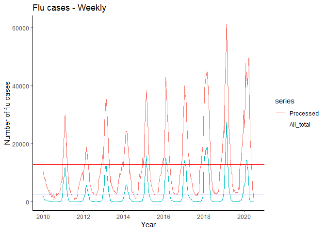<!-- -->

``` r
#A_total ~ B_total

autoplot(fludat_ts[,2:3]) +
  ggtitle("'A' and 'B' type cases - Weekly") +
  theme(plot.title = element_text(hjust = 0.5, size = 20)) +
  xlab("Year") +
  ylab("Number of 'A' and 'B' types") +
  scale_x_continuous(breaks = seq(from = 2010, to =  2020, by = 2)) +
  theme_classic()   
```

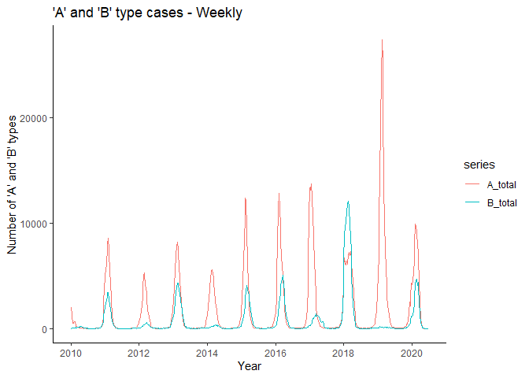<!-- -->

``` r
#seasonality plot ~ All_total

ggseasonplot(fludat_ts[,4], continuous = F, year.labels = F) +
  ggtitle("Seasonality check") + 
  theme(plot.title = element_text(hjust = 0.5, size = 20)) +
  xlab("Week") +
  theme_classic() 
```

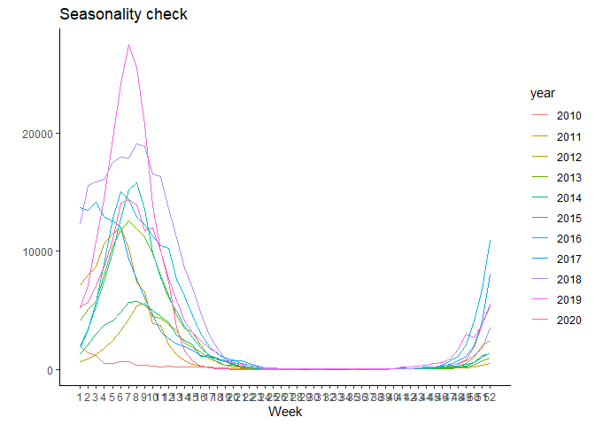<!-- -->

``` r
ggsubseriesplot(fludat_ts[,4])
```

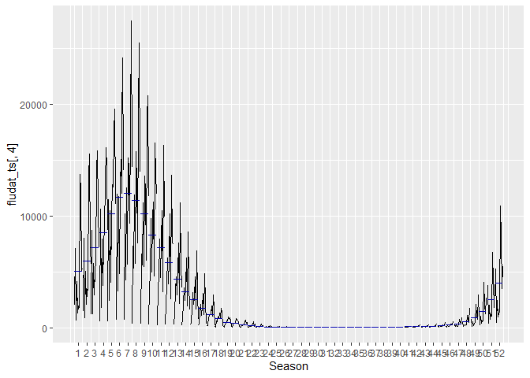<!-- -->

``` r
ggseasonplot(fludat_ts[,4], continuous = F, year.labels = F, polar = T)
```

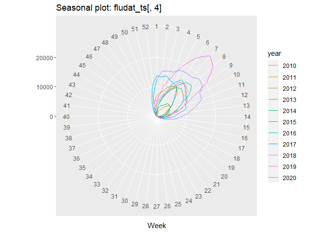<!-- -->

``` r
#decomposition STL

autoplot(stl(fludat_ts[,4], s.window = 11,l.window = 52)) +
  ggtitle("Flu dataset decomposition (2010-2020)") + 
  theme(plot.title = element_text(hjust = 0.5, size = 20)) +
  xlab("Year") 
```

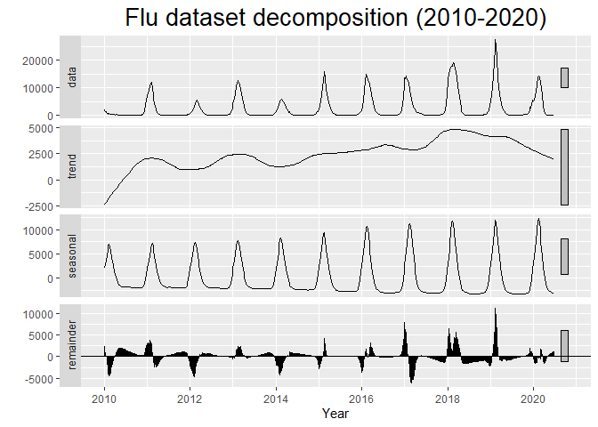<!-- -->

### Modeling:

#### 1\. STLF + ETS

``` r
#1. STL + Exponential smoothing
library(forecast)
library(ggplot2)
library(dplyr)
#Train - Test 80%-20%
train_ets <- window(fludat_ts[,4], end = c(2018,6))

# Modeling, checking residuals
ets_model <- stlf(train_ets, h = 124)
checkresiduals(ets_model)
```

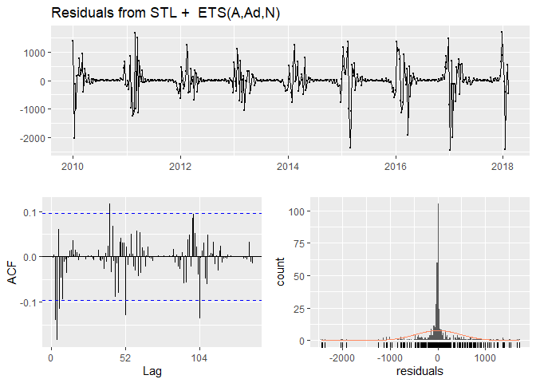<!-- -->

``` r
summary(ets_model)

# Forecasting
ets_forecast <- forecast(ets_model)
```

``` r
# Evaluation
accuracy(ets_forecast, fludat_ts[,4])
```

    ##                        ME      RMSE       MAE      MPE     MAPE      MASE
    ## Training set     4.578192  469.4946  236.3466 2.599979 40.41875 0.1591632
    ## Test set     -2704.357356 4228.5391 3882.9114     -Inf      Inf 2.6148741
    ##                      ACF1 Theil's U
    ## Training set -0.002031421        NA
    ## Test set      0.931537196  689.0018

``` r
# Visualization
autoplot(ets_forecast) +
  ggtitle("STLF model 2 years forecast") +
  theme(plot.title = element_text(hjust = 0.5, size = 20)) +
  xlab("Year") +
  ylab("Number of positive cases") +
  scale_x_continuous(breaks = seq(from = 2010, to = 2020, by = 2)) +
theme_classic() 
```

    ## Scale for 'x' is already present. Adding another scale for 'x', which will
    ## replace the existing scale.

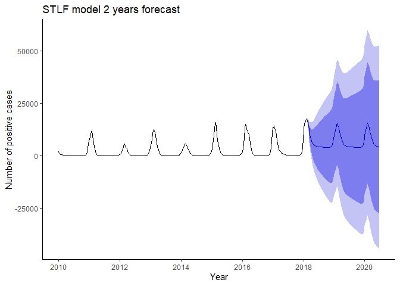<!-- -->

``` r
# Comparing the forecast with the original data
plot(ets_forecast, main = "STLF model forecast", xlab = "Year", ylab = "Number of positive cases") 
  lines(fludat_ts[,4])
```

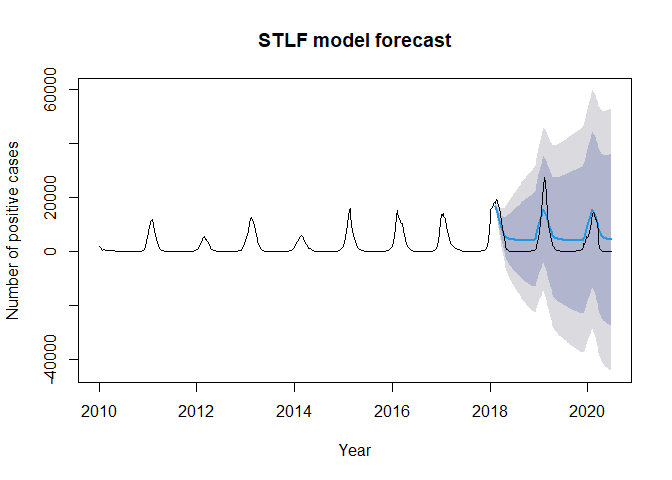<!-- -->

#### ARIMA model

``` r
# Train - Test 80%-20%
train_arima <- subset(fludat_ts[,4], end = length(fludat_ts[,4]) - 104)
```

``` r
# ARIMA modeling, eval = F, final model: ARIMA(2,0,0)(1,1,0)
lambda_arima_test <- BoxCox.lambda(train_arima)
arima_model <- auto.arima(train_arima, stepwise = F, approximation = F,  trace = T)
```

``` r
# Final model: ARIMA(2,0,0)(1,1,0)
arima_model<- Arima(train_arima, order=c(2,0,0), seasonal = list(order=c(1,1,0), period = 52), include.drift = TRUE)
checkresiduals(arima_model)
```

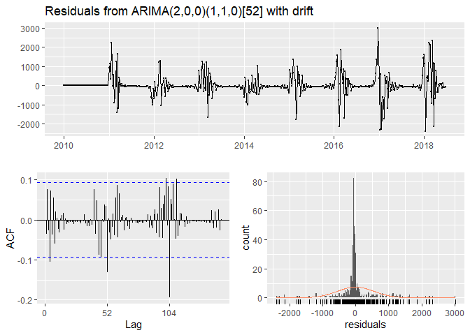<!-- -->

``` r
# Forecasting
arima_forecast <- forecast(arima_model, h = 124)

# Evaluation
accuracy(arima_forecast,fludat_ts[,4])
```

    ##                        ME      RMSE       MAE      MPE     MAPE      MASE
    ## Training set     2.400359  555.7335  281.4358 -112.429 119.9868 0.1695968
    ## Test set     -1467.274693 3685.5264 2403.8000     -Inf      Inf 1.4485601
    ##                     ACF1 Theil's U
    ## Training set -0.03639362        NA
    ## Test set      0.90454026  181.1804

``` r
# Forecasting visualization
autoplot(arima_forecast) +
  ggtitle("ARIMA model 2 years forecast") +
  theme(plot.title = element_text(hjust = 0.5, size = 20)) +
  xlab("Year") +
  ylab("Number of positive cases") +
  scale_x_continuous(breaks = seq(from = 2010, to = 2020, by = 2)) + 
  theme_classic() 
```

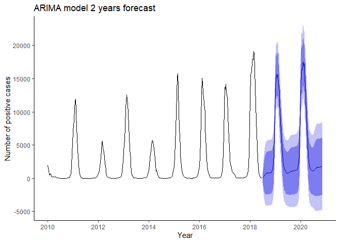<!-- -->

``` r
# Comparing with the original data
plot(arima_forecast, main = "ARIMA model forecast", xlab = "Year", ylab = "Number of positive cases") 
  lines(fludat_ts[,4]) 
```

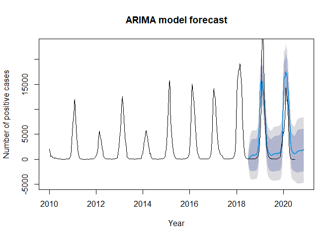<!-- -->

#### TBATS model

``` r
# Train - Test 80%-20%
train_tbats <- window(fludat_ts[,4], end = c(2018,6))

# TBATS modeling 
tbats_model <- tbats(train_tbats)
checkresiduals(tbats_model)
```

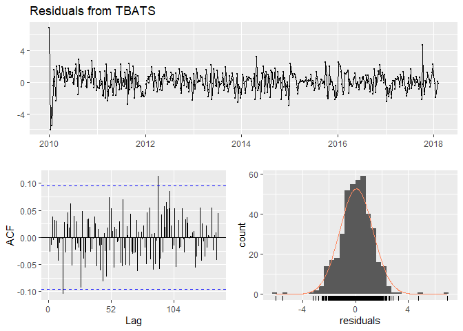<!-- -->

``` r
# Forecasting
tbats_forecast <- forecast(tbats_model, h = 124)
```

``` r
# Evaluation
accuracy(tbats_forecast,fludat_ts[,4])
```

    ##                     ME      RMSE       MAE       MPE    MAPE      MASE
    ## Training set -10.44004  474.1404  216.1237 -3.271943 26.7233 0.1455445
    ## Test set     426.87593 2529.2010 1297.3014      -Inf     Inf 0.8736434
    ##                   ACF1 Theil's U
    ## Training set 0.3242219        NA
    ## Test set     0.9176521  26.76243

``` r
# Forecast visualization
autoplot(tbats_forecast) +
  ggtitle("TBATS model 2 years forecast") +
  theme(plot.title = element_text(hjust = 0.5, size = 20)) +
  xlab("Year") +
  ylab("Number of positive cases") +
  scale_x_continuous(breaks = seq(from = 2010, to = 2020, by = 2)) +
  theme_classic() 
```

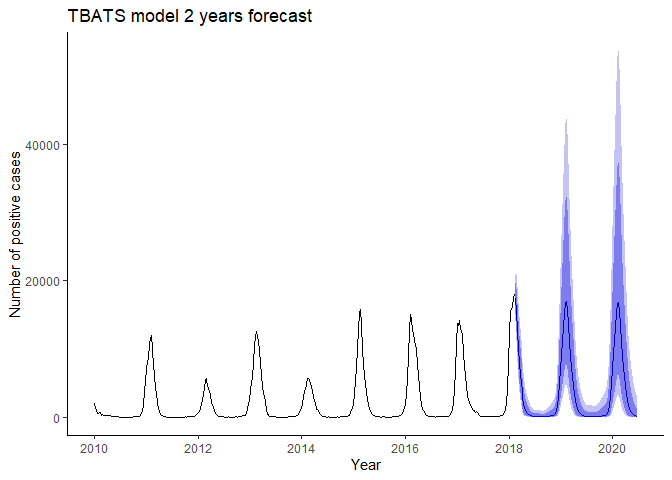<!-- -->

``` r
# Comparing with the original data
plot(tbats_forecast, main = "TBATS model forecast", xlab = "Year", ylab = "Number of positive cases") 
  lines(fludat_ts[,4]) 
```

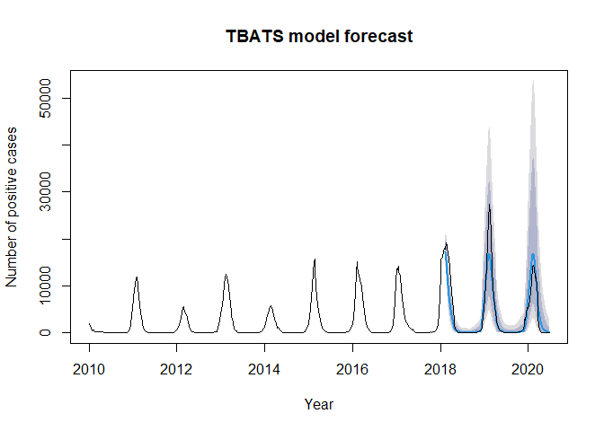<!-- -->

### Choosing the best traditional forecasting model

``` r
### eval = F due to the large number of outpurs

fludat_ts[,4] %>% 
  tbats() %>% 
  forecast(h = 124) %>% 
  autoplot() +
  ggtitle("Flu 2 years forecasting with TBATS model") +
  theme(plot.title = element_text(hjust = 0.5, size = 20)) +
  scale_x_continuous(breaks = seq(from = 2010, to = 2022, by = 2)) +
  xlab("Year") +
  ylab("Number of positive cases")

# Check its values
fludat_ts[,4] %>% 
  tbats() %>% 
  forecast(h = 124) %>% 
  summary() %>% 
  print()
```

### Modeling

``` r
# eval = F due to the large number of outputs

# Creating a vector containing the WHO European countries
countries <- c("Albania",
               "Armenia",
               "Austria",
               "Azerbaijan",
               "Belarus",
               "Belgium",
               "Bosnia and Herzegovina",
               "Bulgaria",
               "Croatia",
               "Cyprus",
               "Czechia",
               "Denmark",
               "Estonia",
               "Finland",
               "France",
               "Georgia",
               "Germany",
               "Greece",
               "Hungary",
               "Iceland",
               "Ireland",
               "Israel",
               "Italy",
               "Kazakhstan",
               "Kyrgyzstan",
               "Latvia",
               "Lithuania",
               "Luxembourg",
               "Malta",
               "Montenegro",
               "Netherlands",
               "North Macedonia",
               "Norway",
               "Poland",
               "Portugal",
               "Republic of Moldova",
               "Romania",
               "Russian Federation",
               "Serbia",
               "Slovakia",
               "Slovenia",
               "Spain",
               "Sweden",
               "Switzerland",
               "Tajikistan",
               "Turkey",
               "Turkmenistan",
               "Ukraine",
               "United Kingdom of Great Britain and Northern Ireland",
               "Uzbekistan")

# Pivoting, modeling, forecasting, evaluating in each country

for (c in countries) {
  
  fludat_country <- fludat[fludat$Country..area.or.territory == c,]
  
  fludat_pivot_country <- fludat_country %>% 
    select(sdate,Processed,A..Total.,B..Total.,Total.number.of.influenza.positive.viruses) %>% 
    group_by(sdate)  %>% 
    summarise(Processed = sum(Processed),A_total = sum(A..Total.), B_total = sum(B..Total.),All_total = sum(Total.number.of.influenza.positive.viruses))
  
  fludat_ts_country <- ts(fludat_pivot_country[,c(2:5)], start = 2010, frequency = 52)
  
  train_tbats_country <- window(fludat_ts_country[,4], end = c(2018,6))
  
  tbats_model_country <- tbats(train_tbats_country)
  
  tbats_forecast_country <- forecast(tbats_model_country, h = 124)
  
  print(c)
  print(accuracy(tbats_forecast_country,fludat_ts_country[,4]))  
  
}
```
